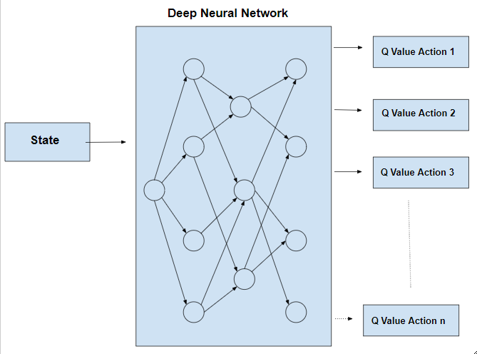

# PyTorch-Snake-Game-Reinforcement-Learning

***Project Outline***

> **`Part 1: Theory`**<br/>
> **`Part 2: Implementing the Game`**<br/>
> **`Part 3: Implementing the Agent`**<br/>
> **`Part 4: Implementing the Model`**<br/>


## `Theory`

1. Reinforcement Learning (RL):<br/>
    It is an area of machine learning concerned with how software agents ought to take actions in an environment in order to **Maximize** the<br/> notion of **Cumulative Reward**.

    So in simple words RL is teaching a software agent how to behave in an environment by telling it how good it's doing.

    <div>
        <br/>
        <div><br/>
            
        </div>
    </div><br/>

2. Agent Training :<br/>
    There are alot of ways/approaches to train an Agent. We will be using **Deep Q Learning** to train our agent.

3. Q Learning :<br/>
    Q-Learning creates an exact matrix for the working agent which it can **“refer to”** to maximize its reward in the long run.<br/>
    Although this approach is not wrong in itself, this is only practical for **very small environments** and quickly loses it’s feasibility when the number of states<br/> and actions in the environment increases.

4. Deep Q Learning :<br/>
    This approach extends RL by using a **Deep Neural Network** to predict the actions.<br/>
    The solution for the above problem comes from the realization that the values in the matrix only have relative importance 
    i.e. the values only have importance with respect to the other values. Thus, this thinking leads us to Deep Q-Learning which uses a deep neural network to approximate the values.<br/> This approximation of values does not hurt as long as the relative importance is preserved. The basic working step for Deep Q-Learning is that the initial state is fed into the neural network and it returns the Q-value of all possible actions as an output.

    <div>
    <br/>
    <div><br/>
        
    </div>
    </div><br/>


**`Note : `Code Organization for this Project**
* Firstly we Implement the Game with PyGame
* Secondly we will Implement the Agent
* Then we will Implement the Model with PyTorch

## `Implemetation Steps : Game, Agent and Model `
    
<br/>
    <div>
    <h2 style="text-align:center">Implementation Steps</h2>
    <br/>
    <div><br/>
        <h2 style="text-align:center">Action and Rewards System</h2>
        <br/>
        <br/>
    <br/>    
        <h2 style="text-align:center">States and Values</h2>
        <br/>
    <br/>    
        <h2 style="text-align:center">Feed Forward Neural Network</h2>
        <br/>
    <br/>
        <h2 style="text-align:center">Deep Q Learning - Model Implementation Steps</h2>
        <br/>
    <br/>
        <h2 style="text-align:center">Activation Function - Bellman Equation</h2>
        <br/>
    </div>
    </div>
<br/>

**`Note : `Q Update Rule Simplified**
* Q = model.predict(state(0))
* Then => Q(new) = R + y * max(Q(state(1)))
* So, the Loss Function becomes<br/>
    L = (Q(new) - Q)^2<br/>
    where (Q(new) - Q)^2=> Mean Squared Error(MSE)<br/>
    => L = MSE


## `Software And Tools Requirements`

1. [GithubAccount](https://github.com)
2. [VSCodeIDE](https://code.visualstudio.com/)
3. [GitCLI](https://git-scm.com/downloads)
4. [AnacondaPackage/JupyterNoteBook](https://www.anaconda.com/products/distribution)

## `Creata a New Environment and Activate!!`

```
conda create -p pygame python==3.7 -y
conda activate pygame/
```

## `Install all the Required Libraries!!`

```
pip3 install -r requirements.txt
```

## `Run the below Command to Install PyTorch`

*`Note - If you are using Jupyter then follow the below steps to Enbale GPU in your Local Environment before executing the pip-command`*<br/>

* Step 1: Download and Install a supported version of Microsoft Visual Studio using this [link](https://visualstudio.microsoft.com/thank-you-downloading-visual-studio/?sku=Community&channel=Release&version=VS2022&source=VSLandingPage&cid=2030&passive=false)
* Step 2: Download and Install CUDA Toolkit using this [link](https://developer.nvidia.com/cuda-downloads?)


**With GPU**: `for the devices with CUDA enabled GPU`

```
pip3 install torch torchvision torchaudio --extra-index-url https://download.pytorch.org/whl/cu117
```

**With CPU**: `for devices with CPU only`

```
conda install pytorch torchvision torchaudio cpuonly -c pytorch
```

## `Run the below command to execute the Project`
```
python agent.py
```

## `Outcome/Results`

Below is the screenshot attached with the results

> After 150 games, the model reached a High Score of 120, with a Mean Score of 20.46.

<br/>
    <div>
        <h2 style="text-align:center">PyGame with Plotted Scores</h2>
        <br/>
    <div>
<br/>

## `Inferences/Further Actions`

> Improve the Deep Q Model so that the Snake doesn't eat itself and improve the accuracy so that our Model learns faster.